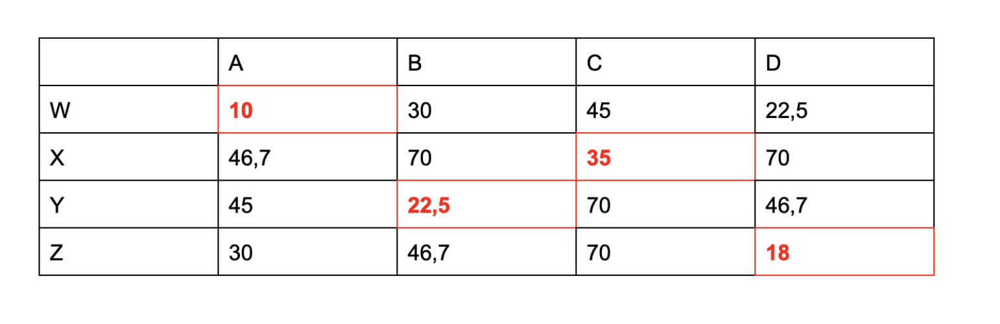

---
title: SAE S2.02 -- Rapport graphes
subtitle: Équipe C6
author: Alex Marescaux, Aliocha Deflou, Valentin Faust, 
date: 2025
---

**Version** **1**

**Choix** **pour** **la** **modélisation**

\_Ci-dessous, H1, H2, etc. désignent des noms d'hôtes ; V1, V2, etc.
désignent des noms de visiteurs. Pour chacun et chacune d'entre iels,
vous devrez donner des valeurs pour les colonnes HOBBIES, GENDER,
PAIR_GENDER et BIRTH_DATE. Vous pouvez réutiliser les mêmes valeurs
plusieurs fois. La présentation des données doit être \*\*lisible\*\*
(par ex. tableau, capture d'écran de tableur avec résolution
suffisante).\_

**Forte** **affinité**

\_Donnez une paire (H1, V1) qui présente une forte affinité. Expliquez
pourquoi.\_


H1 et V1 ont une forte affinité car ils ont des hobbies en communs comme
le Gaming et reading, les genres leurs corresponde et ils ont qu’un an
d’écart

**Faible** **affinité**

\_Donnez une paire (H2, V2) qui présente une faible affinité. Expliquez
pourquoi\_


Cette fois ci, H2 et V2 ont une faible affinité car ils ne partagent pas
du tout les mêmes hobbies et cherche quelqu’un de même sexe.

**Arbitrage** **entre** **les** **critères** **d'affinité**

\_Donnez trois paires hôte-visiteur (H3, V3), (H4, V4), (H5, V5)
d'affinités à peu près équivalentes. Ces paires doivent illustrer
comment vous arbitrez entre les différents critères d'affinité
(passe-temps, préférences de genre, différence d'âge). Donc, idéalement,
les raisons d'affinité seraient différentes dans les trois paires.\_

**Paire** **1** **(H3,** **V3)** **-** **Affinité** **basée** **sur**
**les** **passe-temps** **:**

> ● **H3:**
>
> ○ HOBBIES: reading,gaming,technology ○ GENDER: male
>
> ○ PAIR_GENDER: female
>
> ○ BIRTH_DATE: 2007-08-15 ● **V3:**
>
> ○ HOBBIES: reading,gaming,cinema ○ GENDER: male
>
> ○ PAIR_GENDER: female
>
> ○ BIRTH_DATE: 2009-02-10

Cette paire a une bonne affinité grâce aux passe-temps communs, malgré
une préférence de genre non satisfaite et une différence d'âge
importante.

**Paire** **2** **(H4,** **V4)** **-** **Affinité** **basée** **sur**
**les** **préférences** **de** **genre** **:**

> ● **H4:**
>
> ○ HOBBIES: sports,hiking ○ GENDER: female
>
> ○ PAIR_GENDER: male
>
> ○ BIRTH_DATE: 2008-04-25 ● **V4:**
>
> ○ HOBBIES: music,cinema ○ GENDER: male
>
> ○ PAIR_GENDER: female
>
> ○ BIRTH_DATE: 2009-10-30

Cette paire a une bonne affinité grâce aux préférences de genre
mutuellement satisfaites, malgré l'absence de passe-temps communs et une
différence d'âge de plus d'un an.

**Paire** **3** **(H5,** **V5)** **-** **Affinité** **basée** **sur**
**la** **proximité** **d'âge** **:**

> ● **H5:**
>
> ○ HOBBIES: music,cinema,travel ○ GENDER: male
>
> ○ PAIR_GENDER: female
>
> ○ BIRTH_DATE: 2008-06-10 ● **V5:**
>
> ○ HOBBIES: sports,gaming ○ GENDER: male
>
> ○ PAIR_GENDER: male
>
> ○ BIRTH_DATE: 2008-06-15

Cette paire a une bonne affinité grâce à la proximité d'âge (5 jours de
différence), malgré l'absence de passe-temps communs et des préférences
de genre non satisfaites pour H5.

**Exemple** **complet**

\_Donnez un exemple de quatre hôtes A, B, C, D et quatre visiteurs W, X,
Y, Z. Puis, donnez l'appariement qui vous considérez le meilleur entre
ces hôtes et visiteurs.\_

**Hôtes:**


**Visiteurs:**


Le meilleur appariement serait :

> ● A avec W (plusieurs passe-temps communs, préférences de genre
> satisfaites, âges proches)
>
> ● B avec Y (deux passe-temps communs, préférences de genre
> satisfaites)
>
> ● C avec X (deux passe-temps communs, préférences de genre
> satisfaites, âges très proches)
>
> ● D avec Z (deux passe-temps communs, D n'a pas de préférence de
> genre)

**Score** **d'affinité**

**Donnez** **le** **pseudo-code** **de** **la** **fonction**
**\`score_affinité_1(hôte,** **visiteur)\`** **qui** **retourne** **un**
**nombre** **représentant** **le** **degré** **d'affinité** **entre**
**un** **hôte** **et** **un** **visiteur.**

```
double score_affinité_1(hôte, visiteur)

> // Initialiser le score à une valeur de base
>
> score = 100
>
> // Bonus pour la différence d'âge faible
>
> diff_age = abs(différence_en_mois(hôte.BIRTH_DATE,
> visiteur.BIRTH_DATE)) si diff_age \<= 12 alors
>
> score = score - 30 // Réduire le coût (meilleure affinité)
>
> // Bonus pour les préférences de genre
>
> // Si l'hôte a une préférence et qu'elle est satisfaite

> si (hôte.PAIR_GENDER n'est pas vide) et (hôte.PAIR_GENDER ==
visiteur.GENDER) alors

> score = score - 25 // Réduire le coût
>
> // Si le visiteur a une préférence et qu'elle est satisfaite

> si (visiteur.PAIR_GENDER n'est pas vide) et (visiteur.PAIR_GENDER ==
hôte.GENDER) alors

> score = score - 25 // Réduire le coût
>
> // Bonus pour les passe-temps communs
>
> N = nombre_hobbies_en_commun(hôte, visiteur) si N \> 0 alors
>
> // Plus il y a de passe-temps en commun, plus le score diminue
>
> // Diviser par N pour réduire le coût en fonction du nombre de
> passe-temps partagés score = score / (1 + N \* 0.5)
>
> // Garantir un score minimum positif score = max(score, 1)
>
> retourner score
```

**Retour** **sur** **l'exemple**

**\_Donnez** **la** **matrice** **d'adjacence** **du** **graphe**
**biparti** **complet** **entre** **les** **hôtes** **A,** **B,** **C,**
**D** **et** **les** **visiteurs** **W,** **X,** **Y,** **Z** **que**
**vous** **avez** **introduit** **plus** **haut.** **Les** **poids**
**des** **arêtes** **sont** **donnés** **par** **la** **fonction**
**\`score_affinité_1\`.\_**



**Calculez** **l'appariement** **de** **poids** **minimal** **pour**
**ce** **graphe.** **Obtenez-vous** **l'appariement** **que** **vous**
**aviez** **identifié** **comme** **le** **meilleur** **?\_**

Nous avons surligné en rouge l’appariement optimal pour chaque
etudiants.

Oui nous obtenons les mêmes résultats que nous avons identifiés avant.
Cela veut donc dire que cet algorithme est fiable, du moins pour ces
données la.

# Version 2

_Ci-dessous, vous définirez des hôtes ayant des noms A1, A2, B1, B2, etc., et des visiteurs ayant des noms W1, W2, X1, X2, etc. Pour chacun et chacune d'entre iels, vous devrez donner :_

- _la valeur pour la colonne NAME parmi A1, A2, B1, ..., W1, W2, X1, ... ;_
- _des valeurs pour les colonnes HOBBIES, GENDER, PAIR_GENDER, BIRTH_DATE pour tout le monde ;_
- _des valeurs pour les colonnes HOST_HAS_ANIMAL, HOST_FOOD pour les hôtes ;_
- _des valeurs pour les colonnes GUEST_ANIMAL_ALLERGY, GUEST_FOOD_CONSTRAINT pour les visiteurs._

## Exemple avec appariement total
_Donnez un exemple de quatre hôtes A1, B1, C1, D1 et quatre visiteurs W1, X1, Y1, Z1 pour lesquels il existe des incompatibilités entre certains hôtes et certains visiteurs, mais il est possible de trouver un appariement qui respecte les contraintes rédhibitoires._

**Hôtes :**


**Visiteurs :**

      


_Donnez également l'appariement que vous considérez le meilleur pour cet exemple. Expliquez pourquoi._

## Analyse
Y1 est allergique aux animaux → incompatible avec B1.
W1 a un régime végétarien → doit être apparié avec un hôte qui accepte "vegetarian".

Toutes les contraintes sont respectées pour les appariements suivants :

## Appariement proposé (optimal et total)
A1 — W1 (préférences de genre croisées, hobbies partagés : music, age proche, compatible)
B1 — X1 (compatibles, hobby commun : cinema)
C1 — Z1 (hobby commun : technology)
D1 — Y1 (compatible : nonuts, reading, age proche)

## Conclusion

Cet appariement respecte toutes les contraintes rédhibitoires et maximise les affinités.

## Exemple sans appariement total

_Donnez un exemple de quatre hôtes A2, B2, C2, D2 et quatre visiteurs W2, X2, Y2, Z2 pour lesquels il n'est pas possible de former quatre paires hôte-visiteur à cause d'incompatibilités._

  


_Pour cet exemple, quel est le plus grand nombre de paires qu'on peut former ?_

On peut former seulement 2 paires maximum

_Donnez l'appariement que vous considérez le meilleur. Expliquez pourquoi._

## Analyse

W2, X2 et Z2 sont allergiques aux animaux → incompatibles avec A2 et C2 (tous deux ont des animaux).
Z2 a une contrainte alimentaire (nonuts) → aucun hôte n’accepte "nonuts".

## Appariement possible (au mieux 3 paires)

B2 — Y2 (sports + cooking, age proche, compatibles)
D2 — X2 (music, no animal, compatible)
A2 — W2 impossible (animal chez l’hôte + allergies)
C2 — Z2 impossible (animal + nonuts refusé)

## Appariement proposé

B2 — Y2
D2 — X2
A2 et C2 non appariés
Z2 et W2 non appariés

## Conclusion

Le meilleur appariement possible concerne 2 paires, car les contraintes rédhibitoires ne permettent pas de faire plus.

## Score d'affinité

_Donner le pseudo-code de la fonction `score_affinité_2(hôte, visiteur)` qui retourne un nombre représentant le degré d'affinité entre un hôte et un visiteur. Vous pouvez réutiliser la fonction `score_affinité_1` (l'appeler ou copier du code)._

```
double score_affinité_2(hôte, visiteur)

> // Vérifier les contraintes rédhibitoires et renvoie -1 si il y en a une donc le score ne doit pas être pris en compte

> // Allergie aux animaux
si le visiteur a des allergies et hôte à un/des animaux alors
> retourner -1

> // Régime alimentaire
si visiteur a des contraintes alimentaires n'est pas vide alors
    pour chaque régime dans la liste des contraintes du visteur
        si régime n’est pas dans les regimes accepter par l’hote alors
            retourner -1

> // Historique : refus d’ancien correspondant
si le visiteur ne veut pas retourner avec son ancien hôte  et (hôte était son correspondant précédent) alors
> retourner -1

> // Initialiser le score
score = 100

> // Bonus pour la différence d'âge faible
diff_age = différence_en_mois(Anniversaire Hote,Anniversaire Visiteur)
si diff_age ≤ 18 alors
> score = score - 20

> // Préférence de genre de l'hôte
si (la préférence de genre de l'hôte n’est pas vide) et (la préférence de genre de l'hôte == genre de l’utilisateur) alors
> score = score - 25

> // Préférence de genre du visiteur
si la préférence de genre du visiteur n’est pas vide) et (la préférence de genre de visiteur == genre de l'hôte) alors
> score = score - 25

> // Passe-temps communs
N = nombre_hobbies_en_commun(hôte, visiteur)
si N > 0 alors
> score = score / (1 + N * 0.5)

> // Historique : préférence pour même correspondant
si (visiteur.HISTORY == "same") et (hôte était son précédent correspondant) alors
> score = score - 15

> // Garantir un score minimum
score = max(score, 1)

> retourner score

```

## Retour sur l'exemple

_Donnez les matrices d'adjacence pour les deux exemples de la Version 2 (A1,B1,C1,D1/W1,X1,Y1,Z1 et A2,B2,C2,D2/W2,X2,Y2,Z2). Les poids des arêtes sont déterminés par la fonction `score_affinité_2`. Pensez à nommer les lignes et les colonnes._


_Calculez l'appariement de poids minimal pour chacun des graphes. Obtenez-vous l'appariement que vous aviez identifié comme le meilleur ?_

Oui nous obenons le même --> voir case rouge

## Robustesse de la modélisation (question difficile)

_Est-ce que votre fonction `score_affinité_2` garantit que les contraintes rédhibitoires seront toujours respectées, quel que soit le jeu de données ? Justifiez votre réponse._

Oui, la fonction score_affinité_2 garantit que les contraintes rédhibitoires seront toujours respectées. Pourquoi ?

Elle vérifie en priorité les incompatibilités (allergies aux animaux, régimes alimentaires, refus d’un ancien correspondant).
Si une incompatibilité est détectée, elle retourne -1, ce qui signifie que l’appariement est impossible.

Ce fonctionnement assure que aucun appariement ne se fera si une contrainte rédhibitoire est violée.
Même dans un jeu de données de grande taille où certains adolescents pourraient être compatibles mais peu affins, l’algorithme empêche toute paire interdite.

Un scénario où la fonction pourrait échouer serait celui où les poids des affinités sont trop élevés, au point que l’algorithme privilégie un appariement malgré une contrainte rédhibitoire. Une solution pourrait être d’ajouter une validation finale pour rejeter ces cas.

_**Indications** : Cherchez un exemple de **grande taille** pour lequel la fonction `score_affinité_2` pourrait ne pas garantir le respect des contraintes. Dans cet exemple, vous auriez beaucoup d'adolescents compatibles sans affinité, et quelques adolescents incompatibles avec beaucoup d'affinité._

_Il est possible que votre fonction garantisse le respect des contraintes quel que soit l'exemple. Si vous pensez que c'est le cas, donnez des arguments pour convaincre._ 

**Dans un tel scénario, supposons :**
- 80% des adolescents ont une compatibilité minimale (pas d'incompatibilités rédhibitoires, mais peu de hobbies communs).
- 20% sont fortement affins mais ont des incompatibilités (allergies aux animaux, contraintes alimentaires, refus d’ancien correspondant, etc.).

Dans ce cas, si l'algorithme privilégie l'affinité trop fortement, il pourrait tenter d’apparier des individus incompatibles pour maximiser le score global. La vérification des contraintes rédhibitoires en amont empêche ce cas si bien implémentée.

**Pourquoi score_affinité_2 reste fiable ?**
- Vérification stricte des contraintes rédhibitoires
Les allergies et les refus de correspondants sont vérifiés en premier. Si une incompatibilité est détectée, l’appariement est directement rejeté (score = -1).

- Aucune pondération ne peut surpasser une contrainte rédhibitoire
Même si l’affinité est exceptionnelle, une incompatibilité rédhibitoire bloque le lien avant d’être évalué.


# Version 3

_Ci-dessous, H1, H2, etc. désignent des noms d'hôtes et V1, V2, etc désignent des noms de visiteurs. Pour chacun et chacune d'entre iels, vous devrez donner des valeurs pour toutes les colonnes pertinentes en fonction de leur rôle, hôte ou visiteur._

## Équilibrage entre affinité / incompatibilité

_Donnez au moins quatre paires hôte-visiteur (H1, V1), (H2, V2), (H3, V3), (H4, V4), ... que vous considérez quasi équivalents pour l'affectation. Certaines de ces paires doivent ne pas respecter les contraintes considérées rédhibitoires dans la Version 2, d'autres doivent les respecter. Ces exemples doivent illustrer l'équilibrage que vous faites entre l'incompatibilité d'une part et l'affinité d'autre part : combien et quel type d'affinité permet de compenser combien et quel type d'incompatibilité. Les exemples seront accompagnés de commentaires expliquant vos choix._


## Score d'affinité

_Donner le pseudo-code de la fonction `score_affinité_3(hôte, visiteur)` qui retourne un nombre représentant le degré d'affinité entre un hôte et un visiteur. Vous pouvez réutiliser les fonctions `score_affinité_1` et `score_affinité_2`._

```
fonction score_affinité_3(hôte, visiteur)
    // Vérification des contraintes rédhibitoires : elles peuvent être assouplies selon l'affinité
    score = 100  // Initialisation du score

  

    // Refus d’ancien correspondant (ne peut JAMAIS être compensé)
    si visiteur refuse un ancien correspondant ET hôte est cet ancien correspondant alors
        retourner -1  

    // Bonus sur la différence d'âge
    diff_age = ABS(difference_en_mois(hôte.BIRTH_DATE, visiteur.BIRTH_DATE))
    si diff_age ≤ 18 alors
        score = score - 20  

    // Préférences de genre
    si hôte a une préférence de genre ET elle est respectée alors
        score = score - 25  
    si visiteur a une préférence de genre ET elle est respectée alors
        score = score - 25  

    // Passe-temps communs
    hobbies_communs = nombre_hobbies_en_commun(hôte, visiteur)
    si hobbies_communs > 0 alors
	N= nombre de hobbies en commun
        score = score / (1+N*0,5) 

    // Historique des correspondances (préférence pour un ancien correspondant)
    si visiteur préfère être avec un ancien correspondant ET hôte est cet ancien correspondant alors
        score = score - 15  


// Allergie aux animaux
    si visiteur a une allergie aux animaux ET hôte possède un animal alors
        si score ≤ 20 alors  // Affinité extrême
            score = score + 15  // Compensation maximale (parents s’adaptent totalement)
        sinon si score ≤ 40 alors
            score = score + 25  // Compensation partielle (solutions trouvées)
        sinon
            retourner -1  // Incompatibilité rédhibitoire

    // Régime alimentaire
    si visiteur a des contraintes alimentaires alors
        pour chaque contrainte dans la liste du visiteur
            si contrainte NON acceptée par l'hôte alors
                si score ≤ 20 alors
                    score = score + 15  // Compensation maximale
                sinon si score ≤ 40 alors
                    score = score + 25  // Compensation partielle
                sinon
                    retourner -1

    // Assurer un score minimum positif
    score = MAX(score, 1)

    retourner score

```

## Retour sur l'exemple

_Donnez le résultat de la fonction `score_affinité_3` pour les exemples d'équilibrage (H1, V1), (H2, V2), etc. ci-dessus. Est-ce que vous obtenez des scores proches ?_ 

**Nos resultats**

H1-V1 →  score de 30 même avec le régime qui n’est pas proposé par H1 car l'affinité est très forte de base ( 15 )

H2-V2 → score de 55, il y avait forte affinité de base (15) et des contraintes non respectées. Donc les malus ont été appliqués, +15 puis +25 ( car le score évolue ) ce qui nous donnes 55

H3-V3 → Pas possible car ancien correspondant refusé

H4-V4 → score de 40, contraintes respectés alors pas besoin de malus


_**Remarque**: Deux scores ne sont pas proches ou éloignés dans l'absolu ; cela dépend de la valeur minimale et la valeur maximale que peut prendre le score. Par exemple, les nombres 10 et 20 sont "proches" à l'échelle de l'intervalle de 0 à 1000, mais ne sont pas "proches" à l'échelle de l'intervalle 0 à 30._


