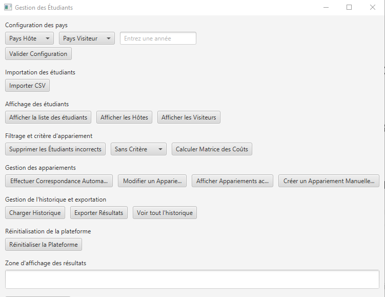

# Rapport IHM - SAE 2.01 & 2.02 Organisation de séjours linguistiques

## Membres du Groupe

- Marescaux Alex
- Deflou Aliocha
- Faust Valentin

## Capture d'écran de l'application finale

## Maquettes Figma

[Lien figma.com](https://www.figma.com/proto/GzA0viePQYKlo5A0OlBh3n/Maquette_SAE?node-id=7729-820&p=f&t=TFxT6qqBReaFSngT-0&scaling=min-zoom&content-scaling=fixed&page-id=7729%3A623&starting-point-node-id=7729%3A820)

## Justification des Choix de Conception

Dans cette section, nous expliquons comment nous avons pris en compte les critères ergonomiques et les guides de conception pour développer notre interface utilisateur.

### Critères Ergonomiques

1. **Utilisabilité :**
   - Nous avons veillé à ce que l'interface soit intuitive et facile à utiliser. Les fonctionnalités principales sont accessibles directement depuis l'écran d'accueil.
   - Des icônes et des libellés clairs sont utilisés pour guider l'utilisateur.

2. **Accessibilité :**
   - L'application respecte les contrastes de couleurs pour une meilleure lisibilité.

3. **Feedback Utilisateur :**
   - Des messages de confirmation et des notifications sont affichés pour informer l'utilisateur des actions réussies ou des erreurs.
   - Les boutons et les interactions fournissent un retour visuel immédiat.

4. **Consistance :**
   - Les éléments de l'interface sont cohérents en termes de style et de comportement à travers toute l'application.
   - Les couleurs et les polices sont uniformes pour une expérience utilisateur harmonieuse.

### Guides de Conception

- **Simplicité :**
  - Nous avons opté pour un design épuré et minimaliste pour éviter la surcharge d'informations.
  - Les fonctionnalités sont organisées de manière logique et hiérarchisée.

- **Flexibilité :**
  - L'interface permet aux utilisateurs d'ajuster les pondérations des critères d'appariement facilement.
  - Les utilisateurs peuvent fixer ou exclure des affectations manuellement.

## Contributions des Membres du Groupe

Détails des contributions de chaque membre du groupe et comment nous avons exploité au mieux les compétences de chacun.

- **Deflou Aliocha :**
  - Développement des interfaces utilisateur en JavaFX
  - Création des maquettes Figma 
  - Ecriture des tests et validation des fonctionnalités

- **Faust Valentin :**
  - Création des maquettes Figma
  - Rédaction du rapport
  - Gestion des erreurs

- **Marescaux Alex :**
  - Gestion du dépôt GitLab
  - Intégration des fonctionnalités de gestion des critères et des algorithmes d'appariement
  - Gestion des données CSV

## Informations Supplémentaires

- **Technologies Utilisées :**
  - JavaFX pour le développement de l'interface utilisateur.
  - Figma pour la création des maquettes.
  - GitLab pour la gestion du code source et des rendus.
  - VSCode pour l'écriture du code.

- **Vidéo de Présentation :**
  - [Lien vers la vidéo de présentation X](lien)

## Conclusion

Ce projet d'organisation de séjours linguistiques a abouti à la création d'un outil efficace et intuitif, répondant aux besoins des enseignants et des adolescents. Grâce à une interface utilisateur développée en JavaFX et à des algorithmes d'optimisation robustes, notre application facilite l'appariement des étudiants en tenant compte de divers critères de compatibilité et d'affinité. Ce projet nous a appris à appliquer les principes de conception ergonomique et d'acquérir une expérience précieuse en développement logiciel,  en gestion de projet et en travail d'équipe.

