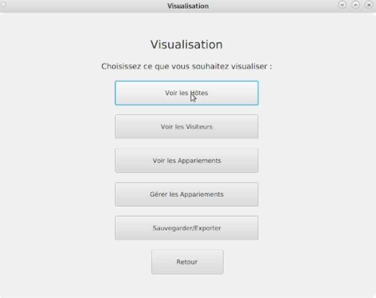
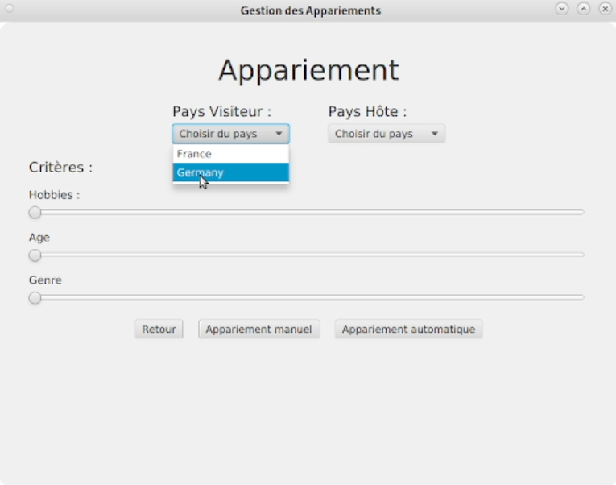

# Rapport IHM - SAE 2.01 & 2.02 Organisation de séjours linguistiques

## Membres du Groupe

- Marescaux Alex
- Deflou Aliocha
- Faust Valentin

## Capture d'écran de l'application finale

## Maquettes Figma

[Lien vers maquettes Figma](https://www.figma.com/design/GzA0viePQYKlo5A0OlBh3n/Maquette_SAE?node-id=7729-623&p=f&t=NiMmKuJq4bn7wPbr-0)

[Lien vers présentation maquettes](https://www.figma.com/proto/GzA0viePQYKlo5A0OlBh3n/Maquette_SAE?node-id=7729-820&p=f&t=TFxT6qqBReaFSngT-0&scaling=min-zoom&content-scaling=fixed&page-id=7729%3A623&starting-point-node-id=7729%3A820)

## Justification des Choix de Conception

Dans cette section, nous expliquons comment nous avons pris en compte les critères ergonomiques et les guides de conception pour développer notre interface utilisateur.

### Critères Ergonomiques

1. **Guidage :**
   - Le système oriente l'utilisateur à travers les étapes clés de l'application en fournissant des indications claires sur la progression et les prochaines actions.
   - Un retour d'information est systématiquement fourni après chaque interaction, validant la prise en compte des actions de l'utilisateur et indiquant l'état actuel du système.

2. **Charge de Travail :**
   - L'interface est conçue pour être concise, affichant uniquement les informations et options pertinentes à chaque moment afin de minimiser la quantité de données à traiter.
   - Le nombre d'actions ou de clics nécessaires pour accomplir une tâche est optimisé, réduisant l'effort cognitif et temporel de l'utilisateur.

3. **Contrôle Explicite :**
   - L'utilisateur conserve la maîtrise des opérations, notamment par la présence de mécanismes lui permettant de naviguer en arrière ou de confirmer des actions critiques.
   - Les actions importantes sont clairement signalées et leurs conséquences sont rendues prévisibles, renforçant la confiance de l'utilisateur dans le système.

4. **Homogénéité / Cohérence :**
   - L'application présente une uniformité visuelle et comportementale à travers l'ensemble de ses écrans et fonctionnalités.
   - Les éléments interactifs et les informations sont présentés de manière constante, facilitant l'apprentissage et la prévisibilité de l'interface.

5. **Prévention des Erreurs :**

    - L'application intègre des mécanismes visant à anticiper et à éviter les erreurs de l'utilisateur, par exemple en ne proposant que des options valides à un instant T.
    - Elle utilise des contrôles appropriés pour la saisie des données, réduisant ainsi la probabilité d'une entrée incorrecte avant même qu'elle ne se produise.
### Guides de Conception

- **Simplicité :**
  - La conception de l'interface privilégie un design épuré et fonctionnel, évitant toute surcharge visuelle ou conceptuelle.
  - Les fonctionnalités sont organisées de manière logique et intuitive, permettant une compréhension rapide de la structure de l'application.

- **Flexibilité :**
  - L'application offre la possibilité d'adapter certains paramètres ou processus aux préférences individuelles de l'utilisateur.
  - Des méthodes alternatives peuvent être proposées pour accomplir des tâches spécifiques, reconnaissant la diversité des approches utilisateur.

## Contributions des Membres du Groupe

Détails des contributions de chaque membre du groupe et comment nous avons exploité au mieux les compétences de chacun.

- **Deflou Aliocha :**
  - Développement des interfaces utilisateur en JavaFX :
    - Responsable de la création des interfaces utilisateur en utilisant JavaFX. Veille à ce que l'interface soit intuitive et facile à utiliser, en mettant l'accent sur l'expérience utilisateur. Son travail a permis de rendre l'application accessible et agréable à utiliser pour les enseignants et les étudiants.
  - Création des maquettes Figma :
    - Création des maquettes sur Figma. Ces maquettes ont servi de guide pour le développement et ont permis à l'équipe de visualiser et de discuter des différentes fonctionnalités et de l'organisation de l'interface.
  - Ecriture des tests et validation des fonctionnalités :
    - Ecriture des tests pour valider les fonctionnalités de l'interface utilisateur. Travail en collaboration avec les autres membres de l'équipe pour s'assurer que toutes les fonctionnalités étaient testées et validées avant leur intégration finale.

- **Faust Valentin :**
  - Création des maquettes Figma : 
    - Création des maquettes sur Figma. L'attention aux détails et la compréhension des besoins des utilisateurs ont permis de créer des designs qui répondent aux attentes des utilisateurs finaux.
  - Rédaction du rapport :
    - Responsable de la rédaction du rapport final du projet. Documentation des différentes étapes du développement, des choix techniques, et des résultats obtenus. Son travail a permis de fournir une vue d'ensemble complète et détaillée du projet.
  - Gestion des erreurs :
    - Travail sur l'identification et la gestion des erreurs dans l'application. Mise en place des mécanismes pour capturer et traiter les erreurs, améliorant ainsi la stabilité et la fiabilité de l'application.

- **Marescaux Alex :**
  - Gestion du dépôt GitLab :
    - Gestion du dépôt GitLab du projet, assurant que le code était bien versionné et que les branches étaient correctement fusionnées. Son travail a permis de maintenir un historique de code clair et organisé, facilitant la collaboration entre les membres de l'équipe.
  - Intégration des fonctionnalités de gestion des critères et des algorithmes d'appariement :
    -  Responsable de l'intégration des algorithmes d'optimisation pour l'appariement des étudiants. Travail sur la logique métier de l'application, s'assurant que les critères d'appariement étaient correctement pris en compte et que les algorithmes fonctionnaient comme prévu.
  - Gestion des données CSV :
    - Développement des fonctionnalités pour manipuler des fichiers CSV. Son travail a permis à l'application de charger et sauvegarder les données des étudiants de manière efficace, facilitant ainsi la gestion des séjours linguistiques.

Nous avons réparti les tâches en fonction des compétences et des intérêts de chacun de manière à ce que le travail soit réalisé le plus rapidement possible 

## Informations Supplémentaires

- **Technologies Utilisées :**
  - JavaFX pour le développement de l'interface utilisateur.
  - Figma pour la création des maquettes.
  - GitLab pour la gestion du code source et des rendus.
  - VSCode pour l'écriture du code.

- **Vidéo de Présentation :**
  - [Lien vers la vidéo de présentation](https://www.youtube.com/watch?v=L_iRFZXEU7o)

## Conclusion

Ce projet d'organisation de séjours linguistiques a abouti à la création d'un outil efficace et intuitif, répondant aux besoins des enseignants et des adolescents. Grâce à une interface utilisateur développée en JavaFX et à des algorithmes d'optimisation robustes, notre application facilite l'appariement des étudiants en tenant compte de divers critères de compatibilité et d'affinité. Ce projet nous a appris à appliquer les principes de conception ergonomique et d'acquérir une expérience précieuse en développement logiciel,  en gestion de projet et en travail d'équipe.

